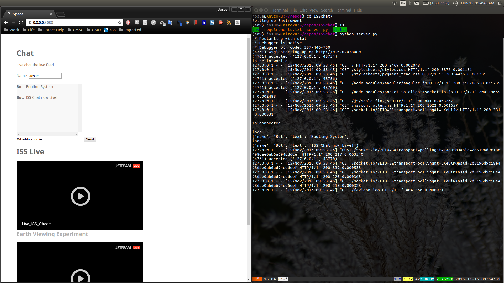

# ISSchat
This is a Walkthrough I did of a ISSchat website using Flask, Socketio, Angularjs, and HTML. The website allows a user to go to the site to watch the Live feed of the International Space Station and have the ability to pick a username to live chat others on the site

---
###To Run

1. Unzip file
2. cd into ISSchat
3. run this
   ``` user@computer:~/ISSchat$ python server.py```

---

###Findings

- You see that all the requests are on the left
- On the right is what it looks like in the browser


